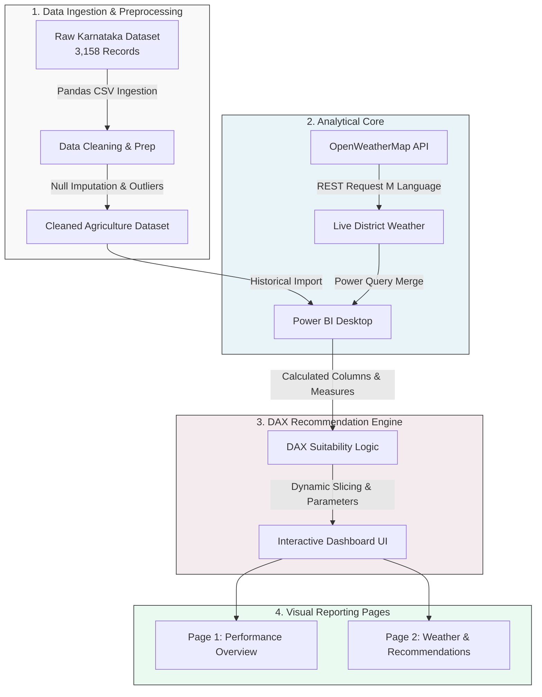

# CropIQ – Agricultural Analytics & Recommendation System

[](https://www.python.org/)
[](https://pandas.pydata.org/)
[](https://powerbi.microsoft.com/)
[](https://openweathermap.org/)
[](https://opensource.org/licenses/MIT)

**CropIQ** is an agricultural analytics platform designed to optimize farming practices, predict crop yields, and recommend suitable crop types across Karnataka. By analyzing a dataset of **3,158 records** containing historical weather, soil, and yield data, and integrating **live weather REST APIs**, CropIQ provides farmers and agricultural planners with actionable data-driven recommendations.

---

## 1. Project Overview & Architecture

CropIQ bridges the gap between historical agricultural data and real-time environmental conditions. The architecture below demonstrates the workflow from raw data ingestion to dashboard visualization and recommendation deployment:



---

## 2. Problem Statement

Karnataka features a highly diverse topography and climate: the coastal Western Ghats receive heavy monsoons, while the northern plateau is prone to drought. Farmers face challenges due to:
* **Erratic Climate Patterns:** Unpredictable rainfall distributions lead to seasonal crop failures.
* **Information Asymmetry:** Lack of matching soil type capabilities with the correct crop choice.
* **Static Decision Making:** Historical crop patterns fail to incorporate real-time climate conditions.

**CropIQ** addresses these challenges by processing historical crop cycles to determine optimal thresholds and querying real-time local weather to validate crop recommendations.

---

## 3. Dataset Description

The analysis is based on a structured dataset comprising **3,158 historical agricultural records** from districts across Karnataka.

* **Geographic Coverage:** Karnataka, India (including major dry/wet zones).
* **Key Variables:**
  * **Categorical:** `District`, `Season` (Kharif, Rabi, Summer), `Soil_Type` (Black, Red, Sandy, Laterite, Clayey), `Crop` (Paddy, Cotton, Maize, Ragi, Wheat, Jowar, Pulses).
  * **Numerical:** `Rainfall_mm` (Seasonal cumulative), `Temperature_C` (Seasonal average), `Yield_Kg_Ha` (Crop yield per hectare).

---

## 4. Preprocessing & Exploratory Data Analysis (EDA)

The data preprocessing and analytical exploration were performed in Python using Pandas, Matplotlib, and Seaborn.

### Key Preprocessing Steps:
1. **Missing Data Imputation:** Imputed missing rainfall and temperature figures using district-season group medians to maintain regional climate integrity.
2. **Outlier Detection:** Inspected rainfall and yield distributions. Yield figures exceeding 3 standard deviations from crop-specific means were capped to eliminate reporting errors.
3. **Standardization:** Cleaned categorical text entries (handling casing and whitespaces).

### Core Insights:
* **Climate Distribution:** Karnataka's rainfall shows a bimodal distribution corresponding to southwest and northeast monsoons, peaking around 800mm and 1200mm.
* **Correlation:** A strong correlation was observed between crop yield and seasonal rainfall in dry-zone districts, while temperature stress above 35°C significantly degraded rabi yields.
* **Soil Preference:** Black soil showed the highest yield density for deep-root cash crops like Cotton, whereas Sandy/Red soil showed maximum resilience for shallow-root millets.

*Refer to the detailed [EDA Process Documentation](docs/eda_process.md) for source code and plots.*

---

## 5. Dashboard Features

The Power BI dashboard is split into two interactive pages designed to address macro-level performance and micro-level recommendations:

### Page 1: Agricultural Performance Overview
* **KPI Header Cards:** Displays Total Records (`3,158`), Average Yield (`2,120 Kg/Ha`), and Average Seasonal Temperature and Rainfall.
* **District Yield Heatmap:** Dynamic map indicating regional agricultural performance.
* **Crop Ranking Visuals:** Comparative dual-axis charts of crop cultivation popularity against average yield rates.
* **Slicer Panel:** Filter the entire canvas by District, Soil Type, and Season.

### Page 2: Crop Recommendations & Weather Insights
* **Live Weather Integration:** Real-time temperature, humidity, and condition alerts for the selected district fetched directly from a REST API.
* **DAX Recommendation Engine:** Dynamically generates crop recommendations matching current visual filters.
* **Optimal vs. Current Climate Gauges:** Compares actual real-time climate inputs against recommended crop growth limits.

*Refer to the [Dashboard Design Documentation](docs/dashboard_design.md) for layouts and styling rules.*

---

## 6. Crop Recommendation Logic (DAX Engine)

The crop recommendation engine is written in **DAX**, allowing instant calculations based on dashboard slicers. The rules categorize crop suitability into environmental envelopes:

* **Kharif Recommendation (High Water/Heat):** 
  * If `Soil = Black` & `Rainfall >= 800mm` & `Temp >= 25°C` -> **Paddy / Cotton**
  * If `Soil = Red` & `Rainfall >= 600mm` & `Temp >= 24°C` -> **Maize / Groundnut**
* **Rabi Recommendation (Cooler/Dry):**
  * If `Soil = Black` & `Rainfall <= 500mm` & `Temp <= 22°C` -> **Wheat**
  * If `Soil = Red/Laterite` -> **Bengal Gram / Ragi**
* **Summer Recommendation (High Heat/Arid):**
  * If `Temp >= 28°C` & `Rainfall <= 300mm` -> **Pulses (Moong/Urad) / Millets**

*Refer to [DAX Logic Documentation](docs/dax_logic.md) and [Crop Recommendation Methodology](docs/crop_recommendation.md) for formulas and validation results.*

---

## 7. Folder Structure

```
cropiq/
│
├── .gitignore                   # Exclusions for Python, IDE, and Power BI temp files
├── README.md                    # Main project overview (this file)
│
├── dashboard/                   # Power BI files (.pbix, templates)
│   └── .gitkeep
│
├── dataset/                     # Historical dataset files
│   └── .gitkeep
│
├── notebook/                    # Jupyter notebooks for data analysis & preprocessing
│   └── .gitkeep
│
├── screenshots/                 # Dashboard captures and visualization plots
│   └── .gitkeep
│
└── docs/                        # Project technical documentation
    ├── eda_process.md           # Python EDA, cleaning pipeline, and statistical insights
    ├── dashboard_design.md      # UI/UX wireframes, visual structure, and color guides
    ├── dax_logic.md             # Custom DAX measures and formatting formulas
    ├── weather_api.md           # Power Query REST API setup and refresh parameters
    └── crop_recommendation.md   # Agronomic rules and recommendation envelopes
```

---

## 8. Installation & Setup

### Python Setup (EDA & Preprocessing)
1. Clone the repository:
   ```bash
   git clone https://github.com/yourusername/cropiq.git
   cd cropiq
   ```
2. Create and activate a virtual environment:
   ```bash
   python -m venv venv
   # On Windows:
   venv\Scripts\activate
   # On macOS/Linux:
   source venv/bin/activate
   ```
3. Install required libraries:
   ```bash
   pip install pandas matplotlib seaborn jupyter
   ```

### Power BI Setup
1. Download and install [Power BI Desktop](https://powerbi.microsoft.com/desktop/).
2. Place the cleaned dataset in the `dataset/` directory.
3. Open Power BI Desktop, load the database, and navigate to **Power Query Editor** to configure API parameters:
   - Double-click the `Weather_API_Key_Parameter` parameter and insert your OpenWeatherMap API key.
   - Close & Apply changes.

---

## 9. Usage
* To execute the data cleaning pipeline, run the Jupyter Notebook in `notebook/` or run the standalone script:
  ```bash
  python notebook/data_preprocessing.py
  ```
* Open `dashboard/cropiq_dashboard.pbix` (once available) in Power BI Desktop to interact with the visualizations, apply district slicers, and view live weather metrics.

---

## 10. Future Improvements
* **Machine Learning Pipeline:** Upgrade the DAX-based recommendation logic to a Python-based Random Forest or XGBoost Classifier to output probabilistic crop suggestions.
* **Soil Nutrient Mapping:** Integrate NPK (Nitrogen, Phosphorus, Potassium) soil attributes to refine recommendation accuracy.
* **Mobile Dashboard Integration:** Develop a mobile-optimized Power BI layout targeting field officers.

---

## 11. License

This project is licensed under the MIT License - see the [LICENSE](LICENSE) file for details.
