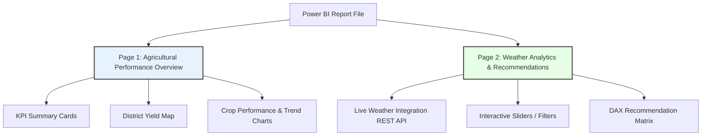

# Power BI Dashboard Design

This document details the architectural and visual design of the two-page Power BI dashboard for the **CropIQ Agricultural Analytics & Recommendation System**. 

---

## 1. Dashboard Structure & User Flow

The dashboard is structured into two main report pages to separate historical macro-level agricultural insights from real-time environmental context and recommendation tools.

---

## 2. Page 1: Agricultural Performance Overview

**Objective:** Provide stakeholders (policymakers, department heads) with a high-level summary of agricultural productivity across Karnataka.

### Visual Elements
1. **KPI Banner (Header):**
   - **Total Cultivated Records:** `3,158` (Dynamic count measure)
   - **Average Yield:** `2,120 Kg/Ha` (Formatted dynamic card)
   - **Average Seasonal Rainfall:** `845.2 mm`
   - **Average Seasonal Temperature:** `27.4 °C`

2. **Geographical Yield Analysis (Map Visual):**
   - **Type:** Filled Map / Bubble Map
   - **Description:** Visualizes average yield (`Yield_Kg_Ha`) mapped by `District`. Districts with high yields are colored in shades of dark green, while lower yield districts appear in light orange.
   - **Interactivity:** Tooltips display District Name, Primary Crop, Average Rainfall, and Average Yield.

3. **Crop Yield and Cultivation Count (Dual-Axis Combination Chart):**
   - **X-Axis:** Crop Names (Paddy, Ragi, Maize, Jowar, Cotton, Sugarcane, etc.)
   - **Y-Axis 1 (Bar):** Average Yield (Kg/Ha)
   - **Y-Axis 2 (Line):** Count of records (to show crop popularity)
   - **Insight:** Highlights which crops are highly productive vs. which ones are frequently grown by farmers.

4. **Sidebar Interactive Filters:**
   - **District Multi-select Slicer** (Dropdown style)
   - **Season Slicer** (Horizontal button style: Kharif, Rabi, Summer)
   - **Soil Type Slicer** (Vertical list checklist)

---

## 3. Page 2: Weather Analytics & Recommendations

**Objective:** Provide actionable insights for farmers or field officers by combining live weather metrics with target crop recommendation rules.

### Visual Elements
1. **Live Weather Integration Cards:**
   - **Source:** REST API (Live OpenWeatherMap integration)
   - **Metrics Displayed:** Current Temperature, Relative Humidity, Wind Speed, and Current Weather Status for the selected district.
   - **Visual Style:** Card visuals with custom formatting that changes color based on temperature thresholds (e.g., orange for >35°C, blue for <20°C).

2. **Recommendation Matrix (Table / Matrix Visual):**
   - **Columns:** Recommended Crop, Suitability Index (High / Medium / Low), Expected Yield Range.
   - **Logic:** Driven by DAX recommendation engine using user-selected filters or district averages for rainfall and temperature.
   - **Conditional Formatting:** High suitability rows are highlighted with a soft green background; low suitability is highlighted in soft red.

3. **Environmental Gauge Charts:**
   - Visual comparison of *current district conditions* against the *optimal conditions* required for the recommended crop.
   - Dual-pointer or target value markers.

---

## 4. UI/UX and Interactive Features

To ensure recruiters and stakeholders experience a premium-grade business intelligence dashboard, the following interactive features are implemented:

* **Dynamic Navigation Buttons:**
  - Sidebar buttons with hover states (darkening/glowing effects) to easily jump between "Performance Overview" and "Recommendations & Weather".
* **Filter Persistence:**
  - Page-level filters set on Page 1 (such as District) automatically propagate to Page 2 to maintain user context.
* **Custom Tooltips:**
  - Hovering over a district's yield bar reveals a micro-chart showing its seasonal rainfall distribution.
* **Clear Filters Bookmarks:**
  - An "Reset All Filters" button linked to a Power BI bookmark that returns all slicers to their default state.

## 5. Theme & Color Palette

The visual design follows a clean, modern "Nature-Tech" palette:
- **Primary Color:** `#2E8B57` (Sea Green - representing agriculture)
- **Secondary Color:** `#4682B4` (Steel Blue - representing climate and water)
- **Neutral Dark:** `#2F4F4F` (Dark Slate Gray - for text and structure)
- **Neutral Light:** `#F5F5F5` (Off-white - for background canvas)
- **Accent Color:** `#FF8C00` (Dark Orange - for warning thresholds and callouts)
- **Typography:** Segoe UI (Standard corporate typeface for clean layout)
